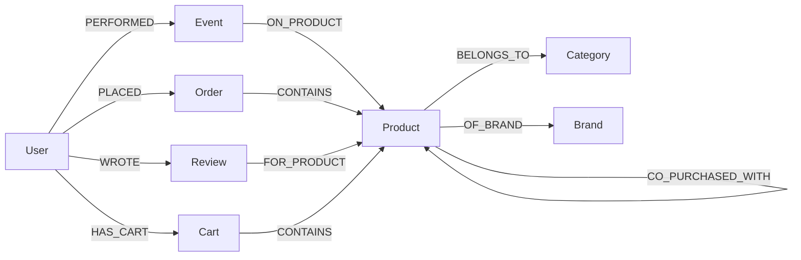

# Customer Behavior Graph — Backend

**Live API**: https://wexa-ai-assessment-server.onrender.com/
**Repo**: https://github.com/kaustubhg-dev/wexa.ai_assessment-server

An Express + CognoDB (openCypher / Bolt, Neo4j-compatible) backend for an e-commerce customer behavior graph, with a set of parameterized read queries and an AI agent endpoint that routes natural language to those same queries.

> **Note on `/api/ask`**: this endpoint is expected to fail on the current deployment. It depends on a Google Gemini API key with an active quota, and the integration was built and tested against a model that Google has since throttled/deprecated mid-development. Every other endpoint is fully functional and does not depend on this. See [Known limitations](#8-known-limitations) for detail.

---

## 1. The use case

Online stores capture huge volumes of behavioral data — views, cart activity, wishlists, purchases — but the *interesting* questions about that data are almost always about **relationships and sequences**, not individual rows: what a customer did over time, what journey led to a purchase, what products are bought together, and why a recommendation was made.

## 2. Why a graph database?

A question like *"customers who viewed a phone, later wishlisted an accessory from the same brand, and purchased a laptop within 30 days"* requires, in SQL, joining `users → events → products → categories → brands` multiple times, self-joining `events` to enforce ordering, and filtering timestamps across all of it — and it gets harder with every additional hop.

In a graph, that's a direct traversal:
```
(User)-[:PERFORMED]->(Event {type:"VIEW"})-[:ON_PRODUCT]->(Product)-[:BELONGS_TO]->(Category)
```
Relationships are stored, not computed at query time, so multi-hop and time-ordered pattern matching stay fast and readable as the chain grows. This project's queries are chosen specifically to lean into that strength (see the funnel and recommendation queries below) rather than ones a relational database would handle equally well.

## 3. Data model



| Node | Key properties |
|---|---|
| `User` | id, name, email, phoneNo, createdAt |
| `Product` | id, name, type, price |
| `Category` | id, name |
| `Brand` | id, name |
| `Event` | id, type, timestamp, device, location |
| `Order` | id, total, status, createdAt |
| `Cart` | id, status |
| `Review` | id, rating, comment |

Design note: relationships are the only source of truth for connections. There are no duplicated foreign-key-style properties (e.g. `Order.userId`) sitting alongside the real `PLACED` relationship — that would create two sources of truth that could drift out of sync, which defeats the point of using a graph database.

## 4. Tech stack

Node.js / Express, controller → service → repository layering, `neo4j-driver` against CognoDB, Google Gemini for the AI agent.

## 5. Setup

### 5.1 Create the CognoDB instance

1. Sign up free at [console.cognodb.com/signup](https://console.cognodb.com/signup) (no credit card).
2. Create a free (**c0**) instance, pick a region. Provisions in under a minute.
3. Copy the connection URI (`bolt+s://<instance-id>.databases.cognodb.cloud`) and the password for user `cognodb` — shown once.

### 5.2 Install and configure

```bash
git clone https://github.com/kaustubhg-dev/wexa.ai_assessment-server
cd wexa.ai_assessment-server
npm install
cp .env.example .env
```

Fill in `.env`:
```
COGNODB_URI=bolt+s://<instance-id>.databases.cognodb.cloud
COGNODB_USER=cognodb
COGNODB_PASSWORD=<your generated password>
GEMINI_API_KEY=<your Gemini API key>
PORT=8080
```

### 5.3 Run the one-time schema setup

```bash
node scripts/runCypherFile.js scripts/schema-constraints.cypher
```
Creates uniqueness constraints and indexes — the graph-DB equivalent of `CREATE TABLE`. Safe to rerun; every statement uses `IF NOT EXISTS`.

### 5.4 Seed the database

```bash
node scripts/seed.js --wipe
```

What this does:
- Wipes any existing data (`--wipe` flag; omit to seed additively).
- Creates the product catalog: 7 brands, 6 categories, 17 products.
- Creates **7 real, testable users** (`U101`–`U107`), each seeded with the *identical* pattern: an event history, a "viewed but never purchased" item, category engagement, a complete funnel-eligible journey, an abandoned cart, and a valid recommendation + explanation path. Because every user is seeded identically, **any of U101–U107 works with the same test queries** — pick one at random and it'll behave the same as the rest.
- Creates 5 hidden "helper" accounts (`isSeedHelper: true`) purely to generate realistic co-purchase statistics behind the scenes. They're excluded from `GET /api/users`.
- Computes `CO_PURCHASED_WITH` edges from the seeded purchase data (done as one cheap read + in-app computation + one batched write, not an expensive in-database join — see inline comments in `seed.js` if curious why).

Watch the terminal until you see the final `✅ Seed complete` line — if it stops or errors before that, rerun `node scripts/seed.js --wipe` (every write uses `MERGE`, so it's safe to retry from scratch).

### 5.5 Run the server

**Development** (nodemon, auto-reloads on file changes):
```bash
npm start
```

**Plain run** (no auto-reload):
```bash
node src/server.js
```

Server listens on the port set in `.env` (default `8080`).

### 5.6 Run the automated smoke test

```bash
bash scripts/test-endpoints.sh
```
Run this **after** steps 5.3–5.5 are complete and the server is up. It hits every endpoint below against the seeded data and prints ✅/❌ per endpoint plus a final pass/fail count — the fastest way to confirm the whole stack is working end to end. `POST /api/ask` is expected to show as ❌ here for the reason noted at the top of this document.

---

## 6. API reference — every endpoint explained

Base URL: `http://localhost:8080` locally, or `https://wexa-ai-assessment-server.onrender.com` against the hosted deploy.

### `GET /health`
Confirms the server is up and connected to CognoDB.
```bash
curl https://wexa-ai-assessment-server.onrender.com/health
```

### `GET /api/users`
Lists all real (non-helper) users, for populating the admin's user picker.

**Cypher:**
```cypher
MATCH (u:User)
WHERE u.isSeedHelper IS NULL
RETURN u.id AS id, u.name AS name, u.email AS email
ORDER BY u.name
```
```bash
curl https://wexa-ai-assessment-server.onrender.com/api/users
```

### `GET /api/categories`
Lists all categories, for populating the funnel query's category dropdowns.
```bash
curl https://wexa-ai-assessment-server.onrender.com/api/categories
```

### `GET /api/users/:id/events?days=50`
What did this user do recently? Single-hop traversal from `User`, time-filtered, enriched with the product and category each event was about.

**Cypher:**
```cypher
MATCH (u:User {id: $userId})-[:PERFORMED]->(e:Event)
WHERE e.timestamp >= datetime() - duration({days: $days})
OPTIONAL MATCH (e)-[:ON_PRODUCT]->(p:Product)
OPTIONAL MATCH (p)-[:BELONGS_TO]->(c:Category)
RETURN e.type AS eventType, e.timestamp AS ts,
       p.id AS productId, p.name AS productName, c.name AS category
ORDER BY e.timestamp DESC
```
```bash
curl "https://wexa-ai-assessment-server.onrender.com/api/users/U101/events?days=50"
```

### `GET /api/users/:id/viewed-not-purchased`
Products this user browsed but never bought — an anti-join expressed as a graph pattern with `NOT EXISTS`.

**Cypher:**
```cypher
MATCH (u:User {id: $userId})-[:PERFORMED]->(v:Event {type: "VIEW"})-[:ON_PRODUCT]->(p:Product)
WHERE NOT EXISTS {
  MATCH (u)-[:PERFORMED]->(:Event {type: "PURCHASE"})-[:ON_PRODUCT]->(p)
}
OPTIONAL MATCH (p)-[:OF_BRAND]->(b:Brand)
RETURN DISTINCT p.id AS productId, p.name AS name, b.name AS brand
```
```bash
curl "https://wexa-ai-assessment-server.onrender.com/api/users/U101/viewed-not-purchased"
```

### `GET /api/users/:id/category-affinity`
Which categories this user engages with most — a two-hop aggregation from `User` through `Event`/`Product` to `Category`.

**Cypher:**
```cypher
MATCH (u:User {id: $userId})-[:PERFORMED]->(e:Event)-[:ON_PRODUCT]->(:Product)-[:BELONGS_TO]->(c:Category)
RETURN c.name AS category, count(e) AS engagement
ORDER BY engagement DESC
```
```bash
curl "https://wexa-ai-assessment-server.onrender.com/api/users/U101/category-affinity"
```

### `GET /api/users/:id/funnel?viewedCategory=&purchasedCategory=&days=`
**The headline query.** A multi-hop, time-ordered journey: viewed a category → wishlisted a product from the *same brand* → purchased a product from another category, all within a time window. This is the query a relational schema would need several self-joins and window functions to express cleanly.

**Cypher:**
```cypher
MATCH (u:User {id: $userId})-[:PERFORMED]->(view:Event {type:"VIEW"})-[:ON_PRODUCT]->(p1:Product)-[:BELONGS_TO]->(c:Category {name: $viewedCategory})
MATCH (p1)-[:OF_BRAND]->(b1:Brand)
MATCH (u)-[:PERFORMED]->(wish:Event {type:"ADD_TO_WISHLIST"})-[:ON_PRODUCT]->(p2:Product)-[:OF_BRAND]->(b2:Brand)
WHERE b1.name = b2.name AND wish.timestamp > view.timestamp
MATCH (u)-[:PERFORMED]->(buy:Event {type:"PURCHASE"})-[:ON_PRODUCT]->(p3:Product)-[:BELONGS_TO]->(:Category {name: $purchasedCategory})
WHERE buy.timestamp > wish.timestamp
  AND duration.between(view.timestamp, buy.timestamp).days <= $windowDays
RETURN u.name AS user, p1.name AS viewed, p2.name AS wishlisted, p3.name AS purchased
```
```bash
curl "https://wexa-ai-assessment-server.onrender.com/api/users/U101/funnel?viewedCategory=Laptops&purchasedCategory=Laptops&days=30"
```

### `GET /api/carts/abandoned?minDays=7`
Users with items sitting in their cart, untouched, for N+ days. Traverses the current-state `Cart` node, independent of the historical event log.

**Cypher:**
```cypher
MATCH (u:User)-[:HAS_CART]->(ct:Cart {status: "ACTIVE"})-[c:CONTAINS]->(p:Product)
WHERE c.addedAt <= datetime() - duration({days: $minDays})
RETURN u.id AS userId, u.name AS userName,
       collect(DISTINCT p.name) AS items,
       min(c.addedAt) AS since
```
```bash
curl "https://wexa-ai-assessment-server.onrender.com/api/carts/abandoned?minDays=7"
```

### `GET /api/users/:id/recommendations?limit=5`
What is this user likely to buy next? Traverses precomputed `CO_PURCHASED_WITH` edges from products they've bought, excluding anything they already own.

**Cypher:**
```cypher
MATCH (u:User {id: $userId})-[:PLACED]->(:Order)-[:CONTAINS]->(bought:Product)-[r:CO_PURCHASED_WITH]->(rec:Product)
WHERE NOT EXISTS {
  MATCH (u)-[:PLACED]->(:Order)-[:CONTAINS]->(rec)
}
OPTIONAL MATCH (rec)-[:OF_BRAND]->(b:Brand)
RETURN rec.id AS productId, rec.name AS name, b.name AS brand,
       max(r.confidence) AS confidence
ORDER BY confidence DESC
LIMIT $limit
```
```bash
curl "https://wexa-ai-assessment-server.onrender.com/api/users/U101/recommendations?limit=5"
```

### `GET /api/recommendations/:productId/explain?userId=`
Why was this product recommended? Returns the actual path connecting the user's own activity to the recommendation — making it explainable by construction, not a black box.

**Cypher:**
```cypher
MATCH path = (u:User {id: $userId})-[:PERFORMED]->(:Event)-[:ON_PRODUCT]->(:Product)-[:CO_PURCHASED_WITH]->(rec:Product {id: $productId})
RETURN [n IN nodes(path) | coalesce(n.name, n.type)] AS chain
LIMIT 1
```
```bash
curl "https://wexa-ai-assessment-server.onrender.com/api/recommendations/P102/explain?userId=U101"
```

### `POST /api/ask`
Takes a natural-language question, uses Gemini to select one of the above queries and extract its parameters (never the target `userId`, which always comes from the request body, not from LLM-parsed text), executes it, and asks Gemini to narrate the result.
```bash
curl -X POST https://wexa-ai-assessment-server.onrender.com/api/ask \
  -H "Content-Type: application/json" \
  -d '{"question": "What did this user do in the last 50 days?", "userId": "U101"}'
```
**Expected to fail on the current deployment** — see [Known limitations](#8-known-limitations).

---

## 7. Environment variables

See `.env.example` in the repo root. Summary:

| Variable | Purpose |
|---|---|
| `COGNODB_URI` | Bolt connection URI from the CognoDB console |
| `COGNODB_USER` | Always `cognodb` |
| `COGNODB_PASSWORD` | Generated password, shown once at instance creation |
| `GEMINI_API_KEY` | Google Gemini API key, powers `/api/ask` |
| `PORT` | Server port (default 8080) |

## 8. Known limitations

- **`/api/ask` currently fails.** During development the Gemini model this integration was built against (`gemini-2.5-flash`) began returning errors ahead of its official deprecation date, and the replacement model has hit intermittent quota/availability issues on the free tier since. The routing/execution/narration architecture is fully implemented (see `services/agentService.js`) and works when Gemini responds successfully — this is a live third-party API availability issue, not a design gap in the query-routing logic itself.
- **Free-tier CognoDB instance** (0.5 vCPU burstable, 256MB RAM) can occasionally return transient `context deadline exceeded` errors under write load. All read repositories use `session.executeRead()`, which auto-retries transient failures; the seed script's heaviest step was rewritten to avoid an expensive in-database join specifically because of this constraint (see comments in `scripts/seed.js`).
- **Helper user accounts** (`U-HELPER-1..5`) exist in the database purely to generate realistic co-purchase statistics and are intentionally excluded from `GET /api/users` via the `isSeedHelper` flag.